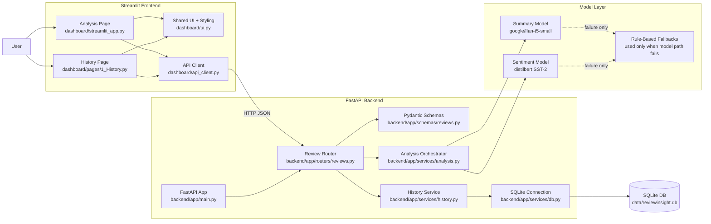
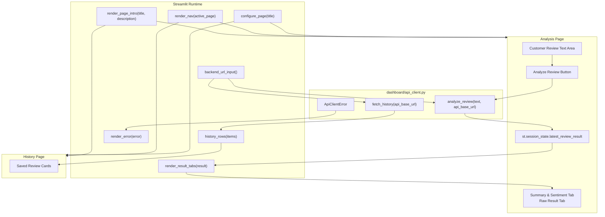
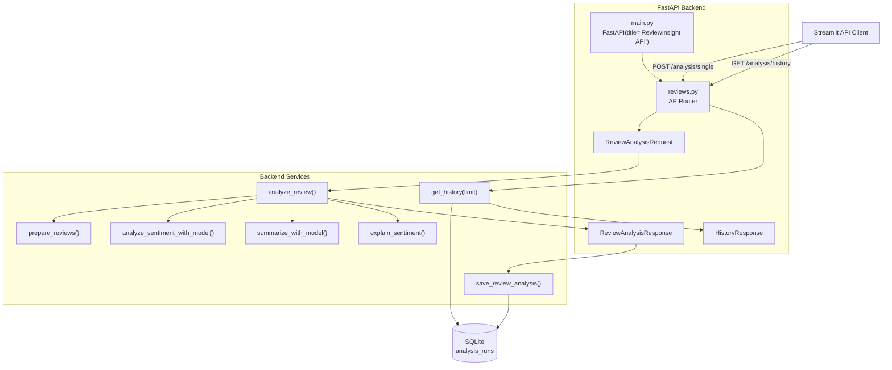
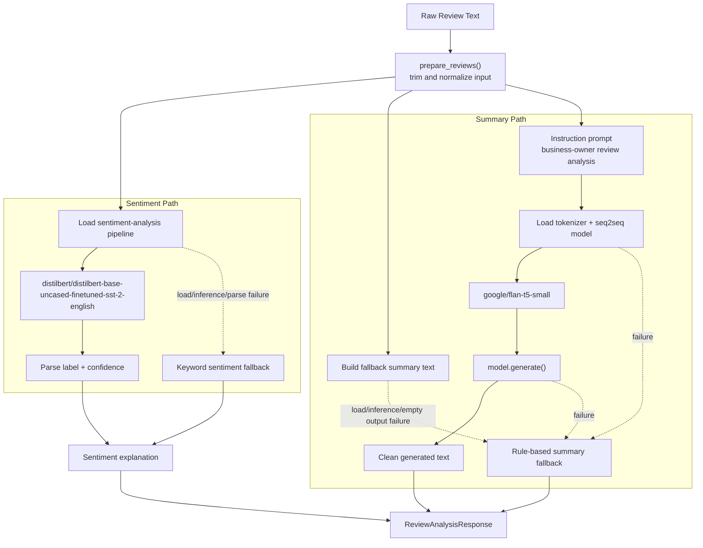
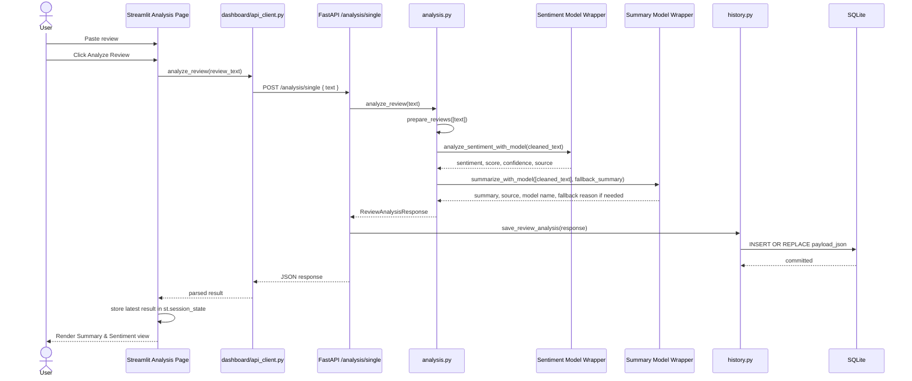
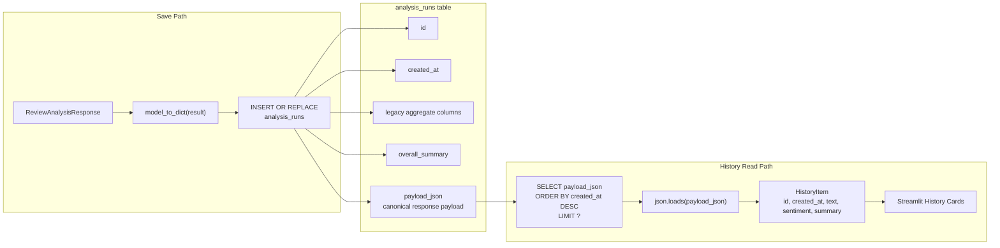
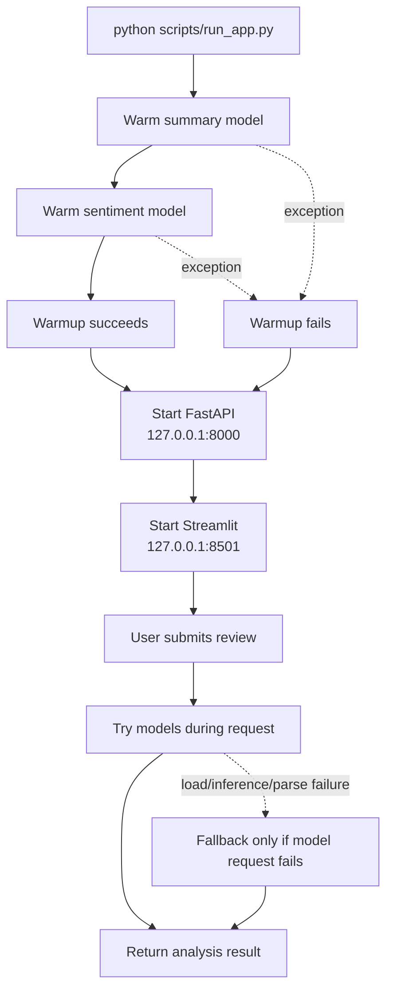
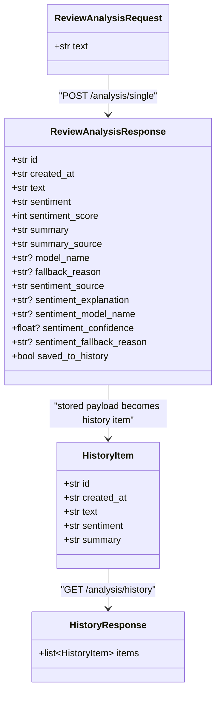

# ReviewInsight Architecture

This document explains ReviewInsight through a set of Mermaid architecture diagrams. The diagrams cover the full product, the frontend, the backend, the model pipeline, persistence, and the end-to-end request lifecycle.

## 1. Whole-System Architecture

This is the highest-level view. Streamlit owns the user experience, FastAPI owns the application boundary, Hugging Face models perform the analysis, and SQLite stores analysis history.

## 2. Frontend Architecture

The frontend is intentionally small. The Analysis page captures one review and renders the latest result. The History page loads saved analyses. Both pages share navigation, styling, result cards, keyword highlighting, and error rendering through `dashboard/ui.py`.

## 3. Backend Service Architecture

FastAPI exposes two routes. `POST /analysis/single` validates the request, runs the analysis service, saves the result, and returns the complete analysis response. `GET /analysis/history` reads saved payloads from SQLite and returns a compact history response.

## 4. Model-First Analysis Pipeline

The analysis pipeline is model-first. Rule-based functions still exist, but they are recovery paths. The summary fallback is built before calling the summary model so it is ready if the model load, inference, or decoding path fails.

## 5. End-to-End Analyze Sequence

This sequence shows the live request path after a user clicks `Analyze Review`.

## 6. History And Persistence

SQLite stores one row per analyzed review. The database keeps legacy aggregate columns for compatibility, but the canonical current data is the serialized `payload_json`.

## 7. Startup And Runtime Responsibilities

The combined runner starts both services. It warms models before launch, but warmup is not a hard dependency. Runtime API requests still try the model path first and fallback only if the model path fails during that request.

## 8. Current Runtime Contracts

## Reading Guide

- Start with the whole-system diagram to understand ownership boundaries.
- Use the frontend and backend diagrams to find files quickly.
- Use the model pipeline diagram to understand model-first analysis and fallback boundaries.
- Use the sequence diagram when debugging a live `Analyze Review` request.
- Use the persistence diagram when changing history behavior or the SQLite schema.
