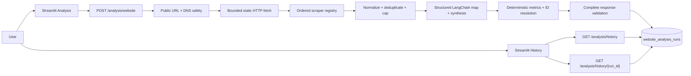
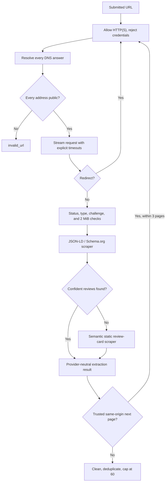
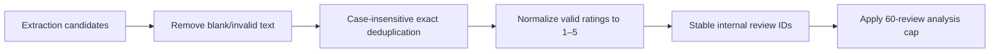
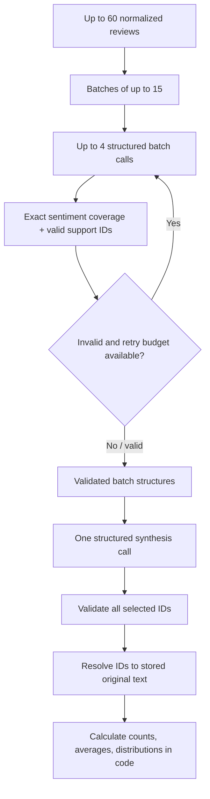
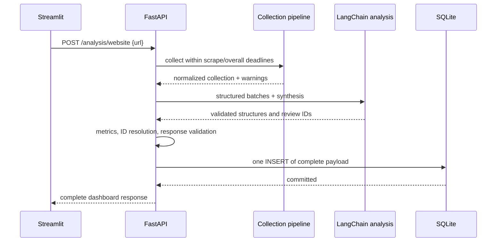

# ReviewInsight Architecture

## Whole system


```mermaid
flowchart LR
    User["User"] --> AnalysisUI["Streamlit Analysis"]
    User --> HistoryUI["Streamlit History"]
    AnalysisUI --> WebsiteAPI["POST /analysis/website"]
    HistoryUI --> HistoryAPI["GET /analysis/history"]
    HistoryUI --> StoredAPI["GET /analysis/history/{run_id}"]

    WebsiteAPI --> Safety["Public URL + DNS safety"]
    Safety --> Fetch["Bounded static HTTP fetch"]
    Fetch --> Registry["Ordered scraper registry"]
    Registry --> Normalize["Normalize + deduplicate + cap"]
    Normalize --> LangChain["Structured LangChain map + synthesis"]
    LangChain --> Metrics["Deterministic metrics + ID resolution"]
    Metrics --> Validate["Complete response validation"]
    Validate --> SQLite[("website_analysis_runs")]

    HistoryAPI --> SQLite
    StoredAPI --> SQLite
```

FastAPI owns validation and orchestration. Streamlit renders only API contracts. SQLite is written once, after a fully completed report validates.

## Fetching and extraction


```mermaid
flowchart TD
    URL["Submitted URL"] --> Parse["Allow HTTP(S), reject credentials"]
    Parse --> Resolve["Resolve every DNS answer"]
    Resolve --> Public{"Every address public?"}
    Public -- "No" --> Invalid["invalid_url"]
    Public -- "Yes" --> Request["Stream request with explicit timeouts"]
    Request --> Redirect{"Redirect?"}
    Redirect -- "Yes" --> Parse
    Redirect -- "No" --> Bounds["Status, type, challenge, and 2 MiB checks"]
    Bounds --> JsonLd["JSON-LD / Schema.org scraper"]
    JsonLd --> Found{"Confident reviews found?"}
    Found -- "Yes" --> PageResult["Provider-neutral extraction result"]
    Found -- "No" --> Static["Semantic static review-card scraper"]
    Static --> PageResult
    PageResult --> Next{"Trusted same-origin next page?"}
    Next -- "Yes, within 3 pages" --> Parse
    Next -- "No" --> Clean["Clean, deduplicate, cap at 60"]
```

The registry is the extension point. A future renderer would be a new fetcher or scraper implementation; orchestration, analysis, persistence, and UI contracts do not depend on browser behavior.

The JSON-LD extractor recognizes direct review objects, lists, graphs, and reviews nested under Schema.org entities such as Product, Restaurant, LocalBusiness, Hotel, Place, LodgingBusiness, Store, Service, and Organization. The static extractor requires review-specific semantic attributes or conservative card class names and a review-body element. It never promotes arbitrary prose to a review.

## Normalized collection

Each analyzed review has a stable internal ID, cleaned original wording, optional normalized rating, traceability fields for non-five-point ratings, optional author/date/source URL, and no rewritten customer text.


```mermaid
flowchart LR
    Candidates["Extraction candidates"] --> Invalid["Remove blank/invalid text"]
    Invalid --> Deduplicate["Case-insensitive exact deduplication"]
    Deduplicate --> Rating["Normalize valid ratings to 1–5"]
    Rating --> StableID["Stable internal review IDs"]
    StableID --> Cap["Apply 60-review analysis cap"]
```

Authors remain in storage and dashboard metadata. Batch prompts serialize only review ID, text, rating, and publication date.

## Structured model analysis


```mermaid
flowchart TD
    Reviews["Up to 60 normalized reviews"] --> Batches["Batches of up to 15"]
    Batches --> BatchModel["Up to 4 structured batch calls"]
    BatchModel --> ValidateBatch["Exact sentiment coverage + valid support IDs"]
    ValidateBatch --> Retry{"Invalid and retry budget available?"}
    Retry -- "Yes" --> BatchModel
    Retry -- "No / valid" --> BatchStructures["Validated batch structures"]
    BatchStructures --> Synthesis["One structured synthesis call"]
    Synthesis --> ValidateSynthesis["Validate all selected IDs"]
    ValidateSynthesis --> Resolve["Resolve IDs to stored original text"]
    Resolve --> CodeMetrics["Calculate counts, averages, distributions in code"]
```

The provider factory is the only module that imports provider-specific classes. It constructs Google Gemini by default or Groq from environment configuration. Provider retries are disabled so the application’s five-call ceiling remains authoritative. Missing credentials, rejected calls, timeouts, and invalid structures become `llm_failed` errors; there is no local analysis fallback.

## Persistence and history


```mermaid
sequenceDiagram
    participant Client as Streamlit
    participant API as FastAPI
    participant Scrape as Collection pipeline
    participant Model as LangChain analysis
    participant DB as SQLite

    Client->>API: POST /analysis/website {url}
    API->>Scrape: collect within scrape/overall deadlines
    Scrape-->>API: normalized collection + warnings
    API->>Model: structured batches + synthesis
    Model-->>API: validated structures and review IDs
    API->>API: metrics, ID resolution, response validation
    API->>DB: one INSERT of complete payload
    DB-->>API: committed
    API-->>Client: complete dashboard response
```

Any failure before the insert creates no history record. A fresh database creates only `website_analysis_runs`. Existing legacy tables are not dropped, read, or written.

## Error boundary

Every handled or unexpected API failure uses:

```json
{
  "error": {
    "code": "scrape_failed",
    "message": "The request could not be completed safely.",
    "stage": "request",
    "retryable": false,
    "details": {}
  }
}
```

Public messages are intentionally stable and sanitized. Raw exception text, provider responses, resolved secrets, and API keys never cross the API boundary.

## File ownership

- `backend/app/settings.py`: defaults, environment values, and hard ceilings.
- `backend/app/errors.py`: typed errors and consistent FastAPI handlers.
- `backend/app/services/url_safety.py`: URL, origin, DNS, and public-address rules.
- `backend/app/services/fetching.py`: bounded static HTTP retrieval.
- `backend/app/scrapers/`: extractor protocol, registry, JSON-LD, and static HTML.
- `backend/app/services/scraping.py`: pagination, partial success, and collection metadata.
- `backend/app/services/normalization.py`: cleaning, rating conversion, IDs, and deduplication.
- `backend/app/services/providers.py`: Gemini/Groq construction only.
- `backend/app/services/analysis.py`: prompts, call budget, structured validation, synthesis, and ID resolution.
- `backend/app/services/metrics.py`: deterministic dashboard arithmetic.
- `backend/app/services/orchestration.py`: deadline-aware end-to-end response assembly and save boundary.
- `backend/app/services/history.py`: complete-payload persistence and website summaries.
- `dashboard/`: URL workspace, structured client errors, dashboard, and stored history.
